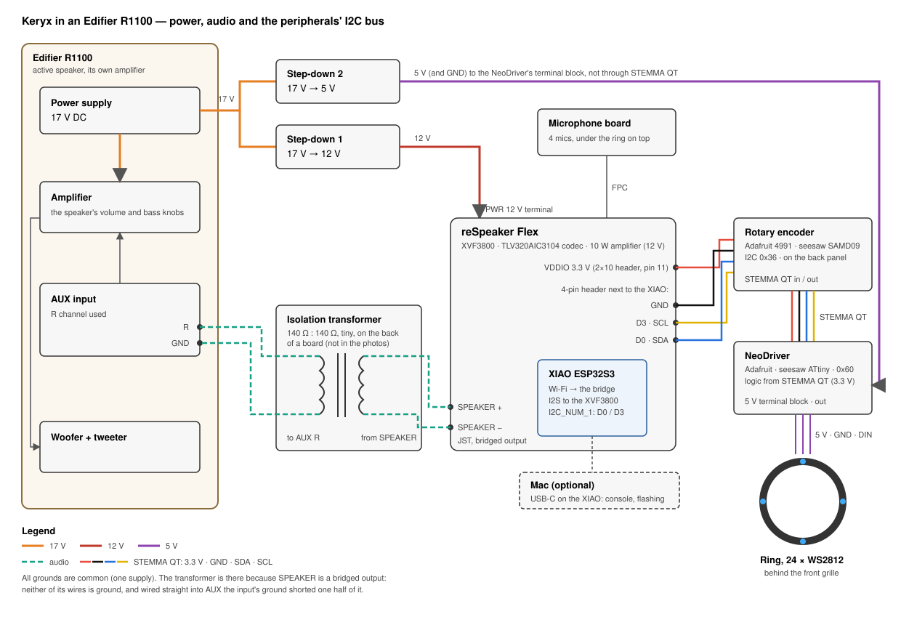

# Assembly: Keryx in an Edifier R1100

The first Keryx lives in an Edifier R1100, an active bookshelf speaker: the reSpeaker Flex with the XIAO on top of
the cabinet, the LED ring behind the front grille, the knob on the back panel. The speaker keeps its own amplifier
and is what plays Keryx; its 17 V supply powers everything.

| Part | Where |
|---|---|
| reSpeaker Flex + XIAO ESP32S3 | on top of the cabinet, the microphone board under the metal ring on the top |
| NeoDriver + ring of 24 WS2812 | the ring behind the front grille, around the tweeter |
| Rotary encoder (Adafruit 4991) | on the back panel, on an aluminium plate where the speaker's input was |
| Audio | the Flex's SPEAKER output (its amplifier, on 12 V) through a 140:140 Ω isolation transformer into the R channel of the speaker's AUX input; the transformer is tiny, on the back of a board, so no photo shows it, only the wires to it |
| Power | the R1100's own 17 V supply: step-down 1 to 12 V for the Flex (its PWR terminal), step-down 2 to 5 V for the ring (the NeoDriver's terminal block) |

The printed parts — the hat over the microphones and the encoder's knob — are in [cad/](../cad/README.md).

The encoder and then the NeoDriver hang on a STEMMA QT bus of their own: 3.3 V from VDDIO (pin 11 of the 2×10
header), GND, D3 as SCL and D0 as SDA from the 4-pin header next to the XIAO — not the XVF3800's bus, which the
encoder hangs: see [respeaker-flex-xvf3800.md](respeaker-flex-xvf3800.md#what-is-free-for-our-own-peripherals). The
ring takes its 5 V from step-down 2 through the NeoDriver's terminal block, not from the 3.3 V of the bus.

All grounds are common: one supply. The transformer is there because SPEAKER is a bridged (BTL) output: neither of
its wires is ground. Wired straight into AUX, the input's ground shorted one half of the bridge — no sound, clicks,
and the board dropped off USB while the speaker was on.

## Photos

The finished speaker: the clock on the ring shows through the grille (the hands at 12, the marks at 3, 6 and 9).

The bench: the Flex with the XIAO, the encoder, the NeoDriver and the ring, the DC-DC, and the speaker's amplifier
board with its back panel.

The ring lit blue (listening) next to the Flex and the speaker's amplifier.

The Flex on top of the cabinet, wired to the speaker's input and the peripherals' bus.

The Flex and the speaker's amplifier board, with the DC-DC for the ring.

The cabinet open: the woofer out, the ring fitted in the front panel, the Flex on top.

Fitting the Flex on the top and the amplifier board back into the cabinet.

The back: the speaker's volume and bass, and the Keryx knob on an aluminium plate.

Done.

